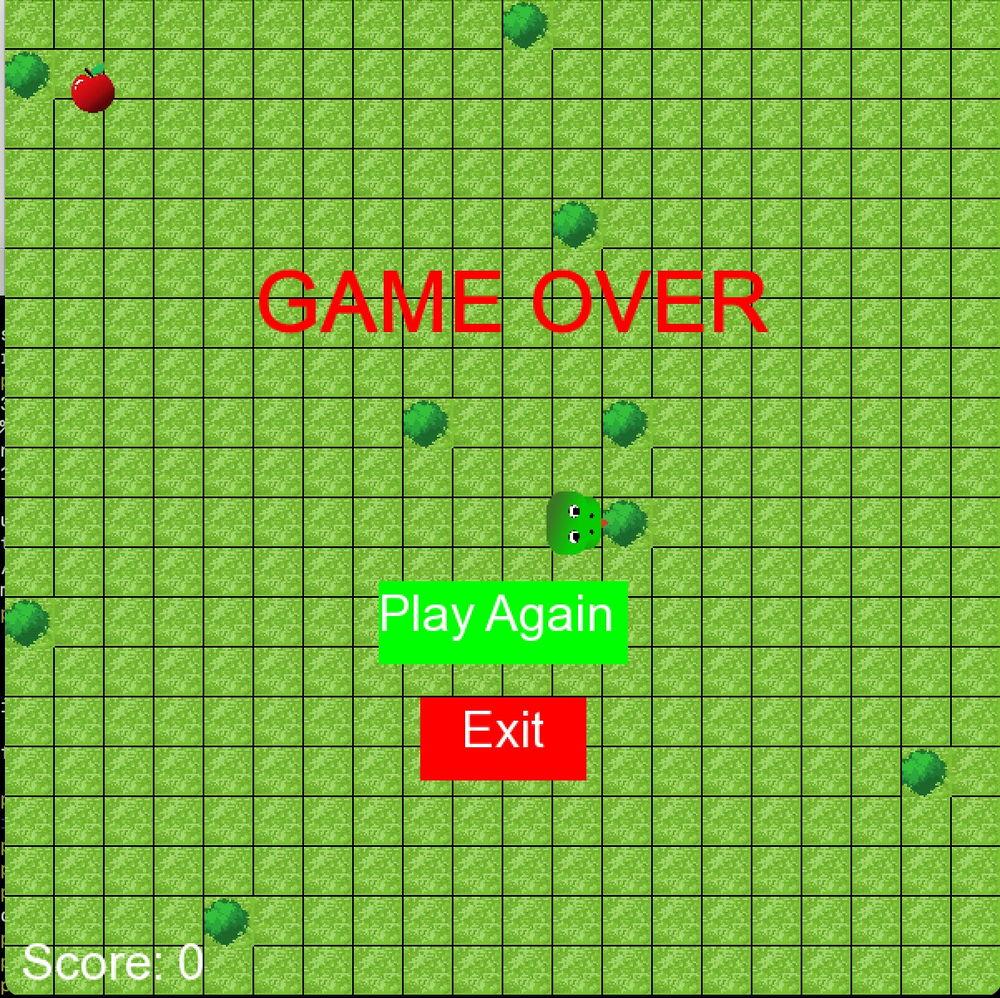

# Snake Game 🐍

A classic Snake game implemented in C++ using the **SFML (Simple and Fast Multimedia Library)**. This project demonstrates object-oriented programming, game development, and multimedia integration.

 <!-- Add a screenshot if available -->

---

## Features ✨
- **Smooth Snake Movement**: Responsive controls for an enjoyable gaming experience.
- **Food Collision Detection**: The snake grows when it eats food.
- **Score Tracking**: Keep track of your score as you play.
- **Sound Effects**: Play sounds for eating food, hitting walls, and moving.
- **Custom Graphics**: Use of custom images for the snake, food, and background.

---

## Requirements 📋
- **C++ Compiler**: `clang++` or `g++`.
- **SFML Library**: Install SFML to handle graphics, audio, and input.
- **Make**: To build the project using the provided `Makefile`.

---

## Installation 🛠️

### 1. Install SFML
#### On Ubuntu/Debian:
```bash
sudo apt install libsfml-dev
```

#### On macOS (using Homebrew):
```bash
brew install sfml
```

#### On Windows:
Download SFML from the [official website](https://www.sfml-dev.org/download.php) and set up your development environment.

---

### 2. Clone the Repository
```bash
git clone https://github.com/javahedi/snakeGame.git
cd snakeGame
```

---

### 3. Build the Game
Use the provided `Makefile` to compile the game:
```bash
make
```

This will generate an executable named `play`.

---

### 4. Run the Game
After building, run the game:
```bash
./play
```

---

## Controls 🎮
- **Arrow Keys**: Move the snake (Up, Down, Left, Right).
- **Esc**: Quit the game.

---

## Project Structure 📂
```
├── Makefile
├── README.md
├── figures
│   ├── bodySnake.png
│   ├── food.png
│   ├── grass.png
│   ├── headSnake.png
│   ├── snake.key
│   ├── snake_screenshot.png
│   └── tree.png
├── fonts
│   └── Arial.ttf
├── include
│   ├── Constants.h
│   ├── Food.h
│   ├── Game.h
│   ├── Landscape.h
│   └── Snake.h
├── sounds
│   ├── eat.mp3
│   ├── hit.mp3
│   └── move.mp3
└── src
    ├── Food.cpp
    ├── Game.cpp
    ├── Landscape.cpp
    ├── Snake.cpp
    └── main.cpp
```

---

## Makefile Targets 🛠️
- **`make`**: Build the game (creates the `play` executable).
- **`make clean`**: Remove all build files (`*.o` and `play`).
- **`make run`**: Build and run the game.

---

## Contributing 🤝
Contributions are welcome! If you'd like to contribute:
1. Fork the repository.
2. Create a new branch (`git checkout -b feature/your-feature`).
3. Commit your changes (`git commit -m "Add your feature"`).
4. Push to the branch (`git push origin feature/your-feature`).
5. Open a pull request.

---

## License 📄
This project is licensed under the MIT License. See the [LICENSE](LICENSE) file for details.

---

## Acknowledgments 🙏
- **SFML**: For providing an excellent multimedia library.
- **You**: For playing the game! 🎉

---

Enjoy the game! 🚀